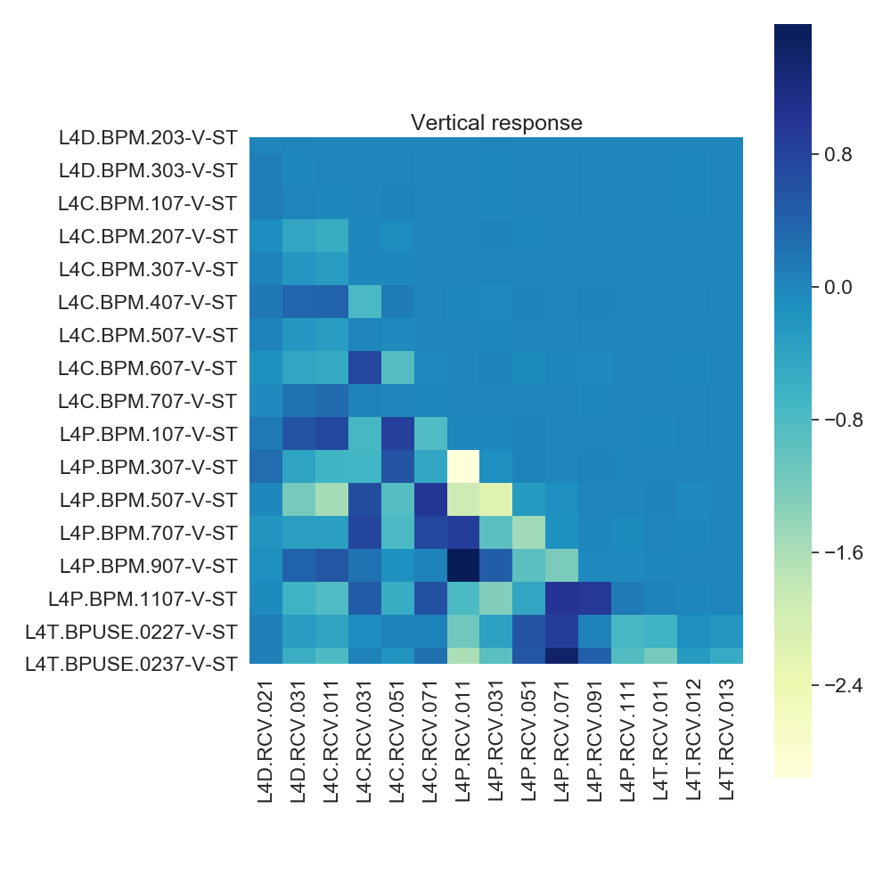

# Linac4_linear_response
A framework to test a new implementation of the NAF RL algorithm.

* Measured linear response of the transferline of Linac 4 at low intensity
* Implementation of the simulation including non-linear perurbations
* Benchmark of several algorithms including the novel PER-NAF
 
Horizontal plane| Vertical plane
------------ | -------------
|
